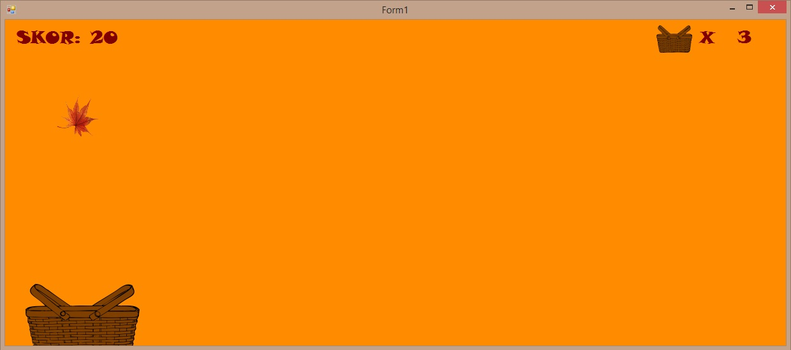

# gorevbasinda
Tez projesi olarak yapıldı. C# dili ile yazıldı. Oyunun ilk aşamasınd giriş ekranı bizi karşılıyor. Giriş ekranından oyunun zorluk derecesini Kolay-Orta-Zor olarak seçebiliyorsunuz. Seçeneği seçtikten sonra oyun ekranına yönlendiriliyorsunuz. Oyun ekranında mouse ile sağa ve sola hareket ettirebileceğiniz bir sepet bulunuyor. Yukarıdan yapraklar düşüyor. Sepete bunları toplamaya çalışıyoruz. Her yaprak sepete girdikçe bize +10 puan kazandırıyor. Sepete girmeden düşen yapraklarda 3 can hakkıyla sınırlı olan can hakkımızdan eksilmektedir. 3 can hakkından sonra oyun sonlanmaktadır.  #

